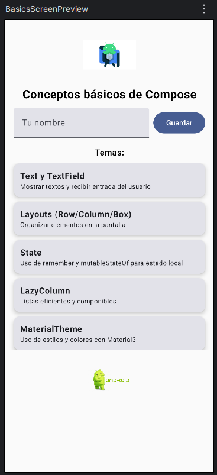

# BasicsCompose

Proyecto del laboratorio – Módulo **Conceptos básicos de Jetpack Compose**.

## Contenido
- Uso de `Text`, `TextField`, `Button` e `Image`.
- Organización de layouts con `Column` y `Row`.
- Listas eficientes con `LazyColumn`.
- Manejo de estado con `remember` y `mutableStateOf`.
- Estilos con `MaterialTheme`.

## Estructura
- `MainActivity.kt` → punto de entrada de la app.
- `ui/BasicsScreen.kt` → interfaz principal.
- `ui/Datasource.kt` → datos de ejemplo.
- `res/drawable/` → imágenes (`compose_logo.png`, `android_logo.png`).

## Ejecución
1. Abrir el proyecto en Android Studio.
2. Usar **Preview** o correr en emulador/dispositivo físico.

## Capturas

### Preview en Android Studio

